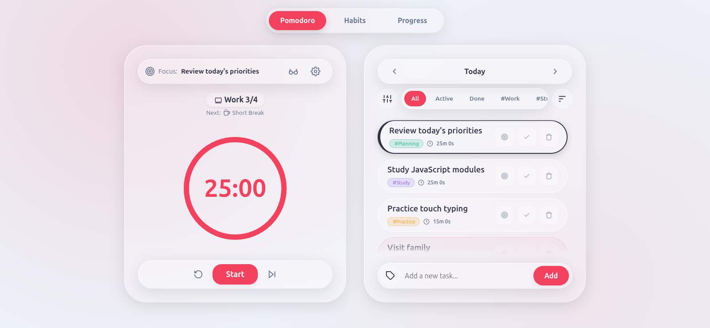
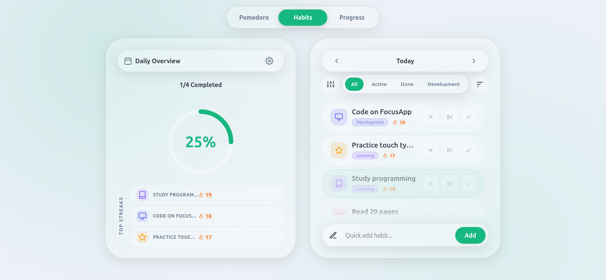
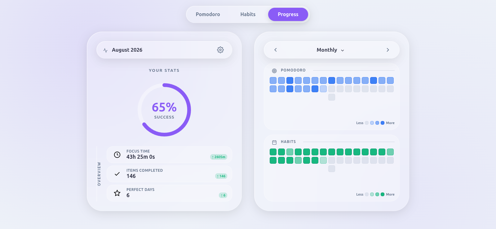
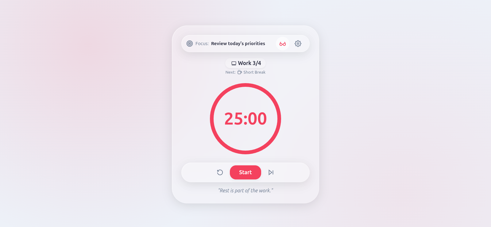
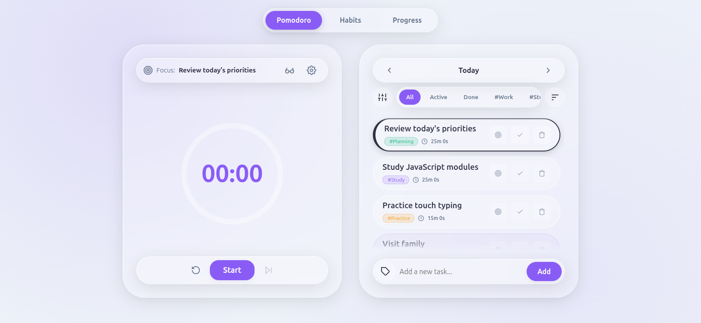
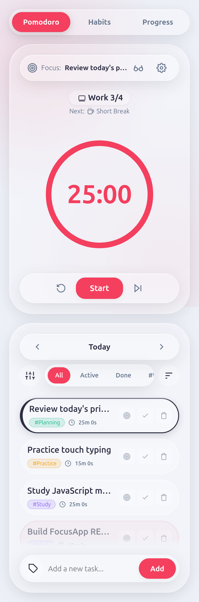
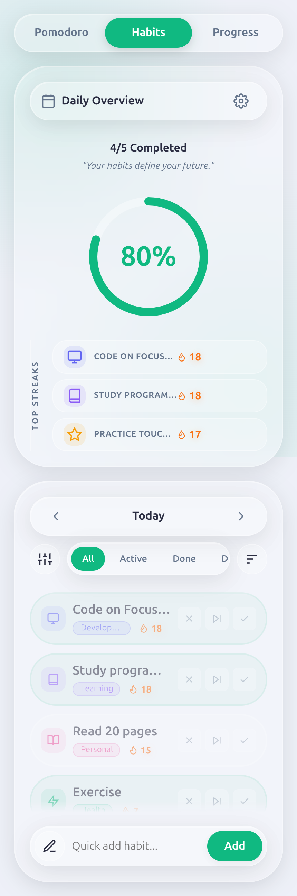
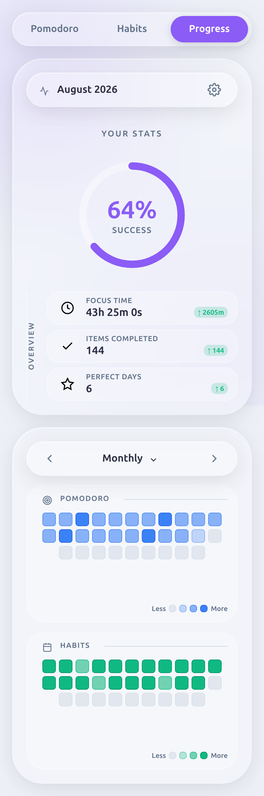
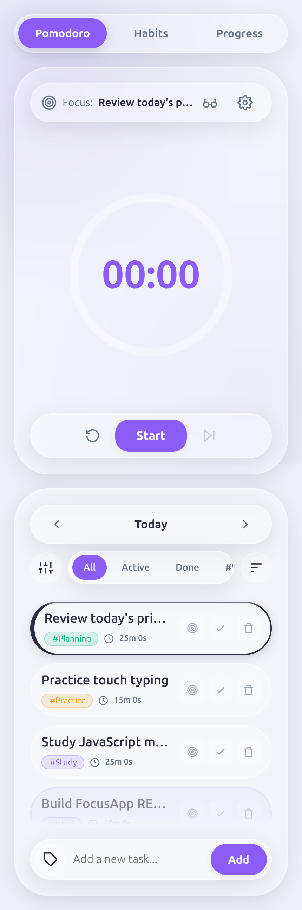
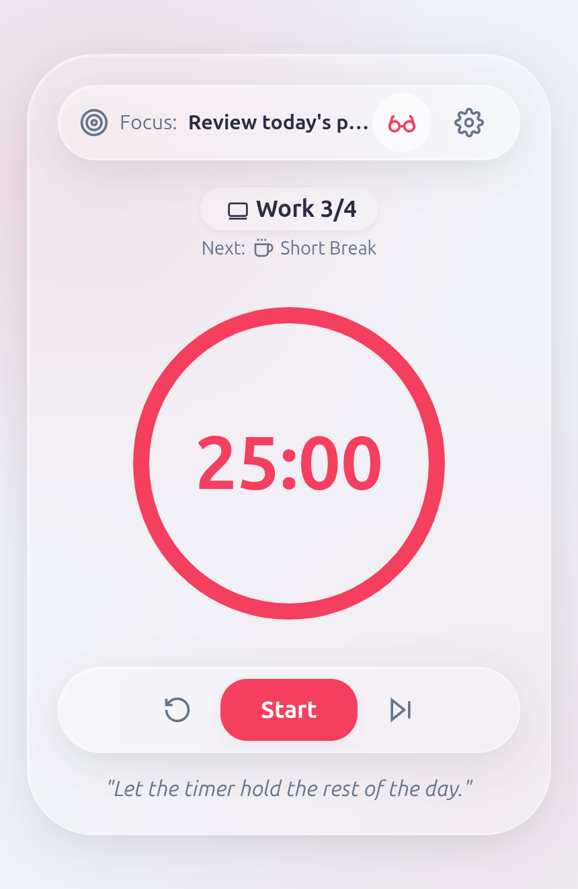

<!-- markdownlint-disable MD033 -->

# FocusApp

A Pomodoro timer, task manager, and habit tracker with focus sessions, streaks, heatmaps, localization (English & Persian), and full data export. All data is stored locally in your browser — no account required, no server, no tracking.

[](https://focus-app-iabolfazlmhm.vercel.app/)


## Live Demo

[Try FocusApp →](https://focus-app-iabolfazlmhm.vercel.app/)

## Screenshots

### Desktop

<p align="center">
  
  
</p>

<p align="center">
  
  
</p>

<p align="center">
  
</p>

### Mobile

<p align="center">
  
  
</p>

<p align="center">
  
  
</p>

<p align="center">
  
</p>

## Features

### Pomodoro Timer & Stopwatch

- **Work / Short Break / Long Break / Stopwatch** count-up modes
- **Drift-corrected timing engine** using `Date.now()` timestamp anchors rather than naive interval subtraction
- **Auto-focus**: automatically focuses the timer on your single active task
- **Dynamic phase themes**: backgrounds, glow accents, and indicators seamlessly update per phase
- **Full session reset**: press and hold or double-click the Reset button

### Task Manager

- Add, complete, delete, edit, and refocus tasks
- Tag tasks with custom color swatches or deterministic hash colors
- Filter by status (All / Active / Completed) and by tag
- Sort by Newest, Time Spent, A-Z, or Tag — with persisted sort and filter choices
- Per-task focus time accumulation with date-accurate attribution

### Habit Tracker

- Flexible cadence scheduling: Daily, Weekly, Bi-weekly, or Custom Days (e.g. Sat + Mon every 2 weeks)
- 38 dynamic icons and custom color-coded categories
- Streak calculation respecting skip days and unlogged current-day states
- Comprehensive calendar heatmap and top streaks widget

### Progress Dashboard & Heatmaps

- Side-by-side activity heatmaps for Pomodoro sessions and habit consistency
- Range selection: Daily, Weekly, Monthly, or Custom Range (with segmented MM/DD/YYYY input)
- Persistence of selected view range, comparison mode, and chart toggles across reloads
- Interactive Daily Report modal with in-place taskless focus time conversion

### Internationalization & Persian / Farsi Support

- Complete localization engine with English and Persian (فارسی) language options
- Real-time language switching with synchronized dropdown previews, filter navigation bubbles, and localized controls across all views
- Full Right-to-Left (RTL) layout switching via `dir="rtl"` and CSS logical properties
- Persian system font stack (`Vazirmatn`, `Vazir`, `Shabnam`, `Geeza Pro`, `Tahoma`) coexisting with self-hosted Ubuntu Sans and Inter
- Anti-FOUC pre-paint initialization preventing layout flashes on page load

### Help & Guide

- Structured, data-driven quick reference topics covering all app sections
- Collapsible `<details>` sections with scannable bullet points and bold lead-ins
- Accessible directly from Settings → Help & Guide

### Data Portability & Trash

- Full JSON export and import backup system
- Soft-delete Trash bin for tasks, habits, tags, categories, and quotes with restoration or permanent deletion

## Quick Start

```bash
# Install dev dependencies (for linting and tests)
npm install

# Run locally (serves index.html on http://localhost:5173 or port of choice)
npm start

# Run linter
npm run lint

# Run the test suite
npm test
```

Or open `index.html` directly in any modern browser — no build step required.

## Project Structure

```text
FocusApp/
├── index.html          # Single-page app markup with SVG sprite and pre-paint head script
├── manifest.json       # PWA manifest
├── package.json        # Project metadata & npm scripts
├── eslint.config.js    # ESLint configuration
├── .gitignore
├── assets/
│   ├── fonts/           # Self-hosted Ubuntu Sans, Inter, & Vazirmatn (woff2)
│   ├── sounds/          # UI and alert audio assets (mp3)
│   ├── motivation.json  # Shipped quote pool
│   └── icon.svg         # Application icon
└── src/
    ├── main.js               # Application bootstrap and global lifecycle listeners
    ├── locales/              # Localization dictionaries
    │   ├── en.js               # English translation dictionary
    │   └── fa.js               # Persian (Farsi) translation dictionary
    ├── styles/               # Global styles & design tokens
    │   ├── fonts.css           # @font-face declarations
    │   ├── variables.css       # Design tokens, CSS custom properties, and theme rules
    │   ├── reset.css           # Base reset, background layers, scrollbar rules, RTL typography
    │   ├── utilities.css       # Reusable layout and fragment utility classes
    │   └── layout.css          # App container, headers, and responsive media queries
    ├── core/                 # Core engine & domain logic
    │   ├── i18n.js             # Translation engine, parameter interpolation, and DOM translator
    │   ├── state.js            # Global in-memory state and setters
    │   ├── storage.js          # Centralized localStorage wrapper with defensive parsing
    │   ├── dom-utils.js        # escapeHTML, generateId, and animateNewListItem
    │   └── date-utils.js       # Shared local calendar date utilities
    ├── shared/               # Reusable widgets (JS + CSS colocated)
    │   ├── buttons.css         # Button variants (.btn, .btn-primary, .btn-secondary, etc.)
    │   ├── color-utils.js      # Color math, hex validation, and hue suggestion
    │   ├── scroll-utils.js     # Horizontal scroll and mobile keyboard visibility helpers
    │   ├── audio.js            # Web Audio engine with procedural synthesis fallbacks
    │   ├── pill.css            # Shared card primitives (.task-item, .task-actions)
    │   ├── split-panel.css     # Shared two-column card layout and landscape responsiveness
    │   ├── filter-bar.css      # Shared All/Active/Done filter bar
    │   ├── modal/
    │   │   ├── modal-utils.js    # Modal accessibility (focus trap, Escape, scroll lock) & confirms
    │   │   └── modal.css         # Modal chrome, sizing modifiers, and action row containers
    │   ├── dropdown/
    │   │   ├── dropdown.js       # Accessible custom select dropdown behavior
    │   │   └── dropdown.css      # Dropdown styling and animations
    │   ├── toast/
    │   │   ├── toast.js          # Toast notifications
    │   │   └── toast.css
    │   ├── tabs/
    │   │   ├── tabs.js           # Tab switching and active bubble animation
    │   │   └── tabs.css
    │   ├── tag-chip/
    │   │   └── tag-chip.css      # Tag and category chips, color swatches
    │   ├── date-nav/
    │   │   ├── date-picker-popover.js # Anchored popover calendar
    │   │   └── date-nav.css      # Date navigation triggers and arrow styles
    │   ├── stepper/
    │   │   ├── stepper-utils.js  # Plus/minus stepper control with hold-to-repeat
    │   │   └── stepper.css
    │   └── date-segment-input/
    │       ├── date-segment-input.js # Segmented MM/DD/YYYY date input
    │       └── date-segment-input.css
    └── features/             # Feature modules (JS + CSS colocated)
        ├── timer/
        │   ├── timer.js          # Pomodoro engine and tick calculation
        │   ├── focus-mode.js     # Focus mode view controller
        │   └── timer.css
        ├── tasks/
        │   ├── tasks.js          # Task manager orchestrator
        │   ├── tasks-render.js   # Task list and filter rendering
        │   ├── tasks-storage.js  # Task persistence and view preference storage
        │   ├── tasks-edit-modal.js
        │   ├── tasks-tags-modal.js
        │   ├── tasks-quick-tag-modal.js
        │   ├── tasks-quick-tag-state.js
        │   ├── tasks-date-nav.js
        │   ├── tasks-sort.js
        │   └── tasks.css
        ├── habits/
        │   ├── habits.js         # Habit tracker orchestrator
        │   ├── habits-render.js  # Habit cards, progress ring, and streak rendering
        │   ├── habits-logic.js   # Recurrence scheduling and streak math
        │   ├── habits-storage.js # Habit persistence and view preference storage
        │   ├── habit-icons.js    # 38 SVG icon paths, labels, and picker renderer
        │   ├── habits-modal-open.js
        │   ├── habits-modal-pickers.js
        │   ├── habits-modal-frequency.js
        │   ├── habits-modal-save.js
        │   ├── habits-modal-state.js
        │   ├── habits-delete-modal.js
        │   ├── habits-categories.js
        │   ├── habits-sort.js
        │   ├── habits-quick-add.js
        │   └── habits.css
        ├── progress/
        │   ├── progress.js       # Dashboard view and preference persistence
        │   ├── progress-stats.js # Statistical calculation engine
        │   ├── progress-heatmap.js
        │   ├── progress-report.js
        │   └── progress.css
        ├── settings/
        │   └── settings.js       # Settings modal, language selection, and data import/export
        ├── quotes/
        │   ├── motivation.js     # Quote engine and override layer
        │   ├── quotes.js         # Manage quotes modal
        │   └── quotes.css
        └── trash/
            ├── trash.js          # Soft-delete store
            ├── trash-ui.js       # Trash modal UI
            └── trash.css
```

## Testing

The project includes an automated test suite covering persistence, data calculation, date handling, habit recurrence, audio/color utilities, view preferences, habit icons, and i18n localization:

```bash
npm test
```

Runs on Node's native test runner (`node --test`).

## License

MIT
